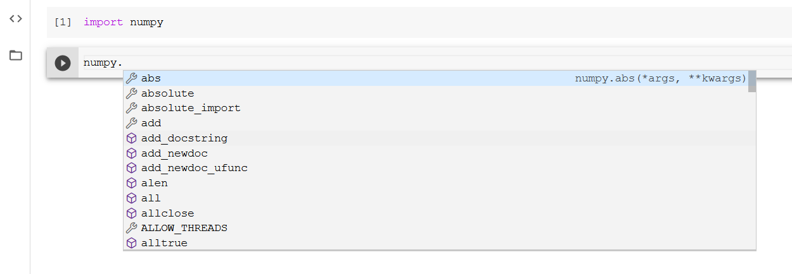
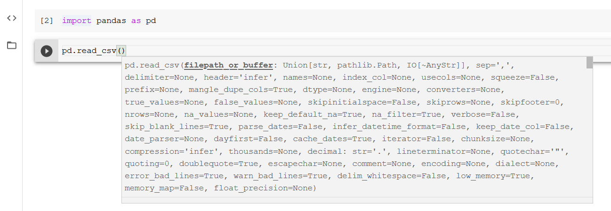

# Tutoriel sur Colaboratory
Adapté et traduit de https://www.tutorialspoint.com/google_colab/your_first_colab_notebook.htm

# Accéder à Google
Avant de commencer à utiliser Colab, il faut s'assurer d'avoir un compte Google afin de pouvoir utiliser Google Drive ainsi que Google Colab.

Aller sur https://colab.research.google.com et cliquez ensuite sur **Nouveau Notebook**.

## Changer le nom du Notebook
Par défaut, le Notebook s'intitule **UntitledXX.ipynb**. On peut le renommer en cliquant sur le titre:

## Sauvegarder sur Google Drive
Pour sauvegarder sur Google Drive, aller sur Fichier -> Enregistrer une copy sur Google Drive.

## Partager le Notebook
Il est possible de partager le Colab Notebook en cliquant sur le bouton Partager qui se situe en haut à droite.

## Commencer à programmer
Les notebook colab sont identiques aux notebooks Jupyter, bien que l'interface en ligne de Colab se présente de façon différente à celle de Jupyter. 

On commence à écrire du code Python dans la fenêtre et l'exécuter en cliquant sur le bouton ci-dessous:

Il est possible d'enlever le résultat du code en cliquant sur le `X`:

## Ajouter des cellules de code
Pour ajouter plus de code dans un notebook, il suffit d'aller dans le menu `Insertion` puis `Cellule de code`. Sinon, vous pouvez déplacer votre souris en bas d'une cellule. Lorsque les choix `Code` et `Texte` apparaissent, cliquez tout simplement sur l'un des deux pour ajouter une nouvelle cellule.

## Tout exécuter
Pour exécuter toute les cellules de votre notebook en un seul clic sans interruption, allez sur `Exécution` et ensuite `Redémarrer et tout exécuter`.

## Changer l'ordre des cellules
Il est possible de changer l'ordre des cellules à l'aide des flèches:

## Supprimer une cellule
Pour supprimer une cellule, il suffit de cliquer sur la poubelle. Sinon faire clique-droit et `Supprimer la cellule`.

## Markdown
Les cellules de texte sont du format **markdown**, un language simple de balisage du texte . Voici quelques exemples de syntaxe ([documentation Jupyter](https://jupyter-notebook.readthedocs.io/en/latest/examples/Notebook/Working%20With%20Markdown%20Cells.html)):

## Équations mathématiques
Pour écrire des équations mathématiques, il suffit d'ajouter les signes d'argent ($) entre les équations et d'utiliser la [syntaxe de Latex](https://www.overleaf.com/learn/latex/mathematical_expressions):

## Tracer des courbe
De la même façon que dans les notebook Jupyter, il est possible de créer des graphiques, par exemple:

## Liste de fonctions
Pour connaître la liste des fonctions d'une bibliothèque, comme `numpy`, il suffit de mettre un point après le nom de la fonction comme ceci:

## Documentation de la fonction
Pour connaître la documentation de chaque fonction, il suffit d'ajouter des parenthèses vides après le nom de la fonction et une fenêtre s'affichera avec la documentation:

